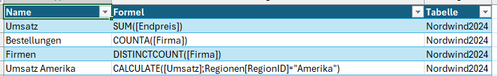
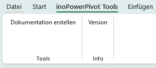
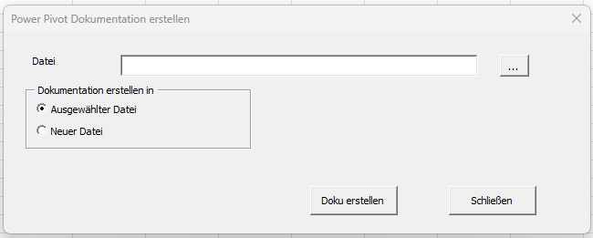

# inoPowerPivotTool

Die Datei `inoPowerPivotTool.xlsm` stellt Funktionen zur Dokumentation von PowerPivot zur Verfügung.

Zur Zeit werden alle in PowerPivot angelegten Measures in eine separate Tabelle geschrieben. Diese Tabelle enthält den Namen des Measures, die Formel und den Bereich, in dem Das Measure in PowerPivot abgelegt ist.

## Installation

Zunächst wird die Datei `inoPowerPivotTool`.xlsm aus dem Ordner [downlaod](./download/) herunter geladen und entsprechend ablegt.

Nun wird die Datei `inoPowerPivotTool.xlsm` geöffnet.

Nach dem ersten Öffnen erscheint ein Sicherheitshinweis.

Hier bitte `Makros aktivieren` auswählen.

Jetzt ist die Datei einsatz bereit.

## Nutzung

Im Menü findet sich der Eintrag `inoPowerPivot Tools`.

### Tools

Mit Dokumentation erstellen wird der Prozess gestartet.

Bei Datei wird mit der Schaltfläche  `...` die Datei, die die PowerPivot-Informatioen beinhaltet, ausgewählt. Dabei ist es unerheblich, ob die Datei geöffnet oder geschlossen ist.

Bei `Dokumentation erstellen in` kann ausgewählt werden, ob die Dokumentation in der ausgewählten Datei oder in einer seperaten Datei erfolgen soll.

Mit `Doku erstellen` wird die Dokumentation gestartet.

Wenn die bei Datei hinterlegte Datei nicht gefunden werden kann,  wird dies über einen Fehler dargestellt.

Mit `Schließen` wird das Formular geschlossen.

### Info

Unter Info - Version wird die aktuelle Version des Tools angezeigt. Aktuell ist es die Version 0.1.
